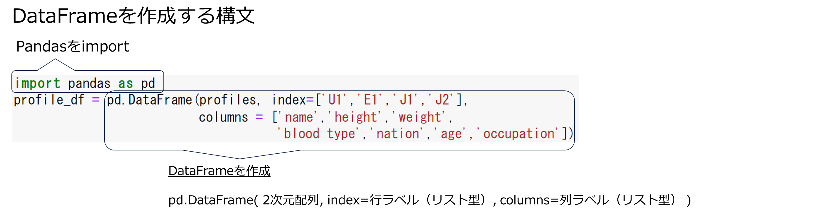
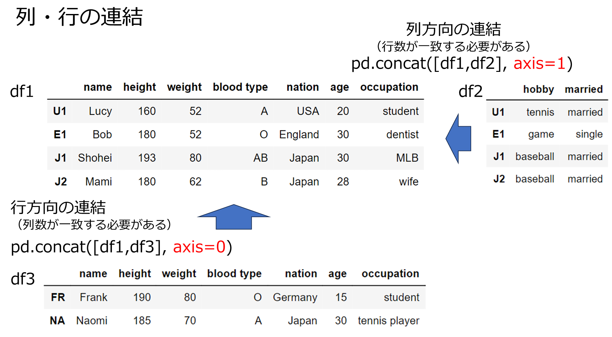
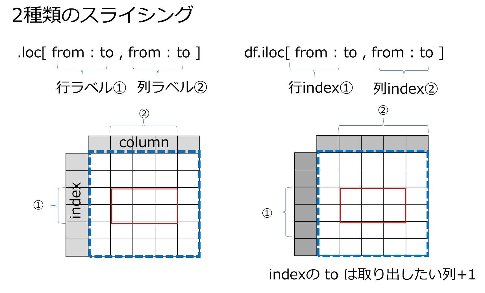

# 表形式データ：データ分析のためのデータ形式
### データ分析に向いているデータの形式は以下のようなもの
   - １つの行が１つのデータ > 行方向にデータが並んでいる
   - 各列がデータの1項目 > 列方向にデータの項目が並んでいる


# 1. データ分析のデータ形式：DataFrame
1. 行見出し、列見出しが付いたnumpy2次元配列　
1. 行、列を自由に追加・削除できる　
2. 特定の行、列を様々な条件で抽出できる
3. 表形式での計算が容易（行合計、列合計、小計など）かつ高速


# 1. DataFrameを作成する
1. 2次元配列を作る


```python
import numpy as np

profiles =[['Lucy',160,52,'A','USA','20','student'],
 ['Bob',180,52,'O','England','30','dentist'],
 ['Shohei',193,80,'AB','Japan','30','MLB'],
 ['Mami',180,62,'B','Japan','28','wife']]
profiles
```


    [['Lucy', 160, 52, 'A', 'USA', '20', 'student'],
     ['Bob', 180, 52, 'O', 'England', '30', 'dentist'],
     ['Shohei', 193, 80, 'AB', 'Japan', '30', 'MLB'],
     ['Mami', 180, 62, 'B', 'Japan', '28', 'wife']]


2. 見出しを付ける  
列見出し：データ項目が多くなると意味がわかるようにしたい  
行見出し：同名があるかもしれないので、idで識別したい


```python
import pandas as pd
profile_df = pd.DataFrame(profiles, index=['U1','E1','J1','J2'],
                          columns = ['name','height','weight',
                                     'blood type','nation','age','occupation'])
profile_df
```


<div>
<style scoped>
    .dataframe tbody tr th:only-of-type {
        vertical-align: middle;
    }

    .dataframe tbody tr th {
        vertical-align: top;
    }

    .dataframe thead th {
        text-align: right;
    }
</style>
<table border="1" class="dataframe">
  <thead>
    <tr style="text-align: right;">
      <th></th>
      <th>name</th>
      <th>height</th>
      <th>weight</th>
      <th>blood type</th>
      <th>nation</th>
      <th>age</th>
      <th>occupation</th>
    </tr>
  </thead>
  <tbody>
    <tr>
      <th>U1</th>
      <td>Lucy</td>
      <td>160</td>
      <td>52</td>
      <td>A</td>
      <td>USA</td>
      <td>20</td>
      <td>student</td>
    </tr>
    <tr>
      <th>E1</th>
      <td>Bob</td>
      <td>180</td>
      <td>52</td>
      <td>O</td>
      <td>England</td>
      <td>30</td>
      <td>dentist</td>
    </tr>
    <tr>
      <th>J1</th>
      <td>Shohei</td>
      <td>193</td>
      <td>80</td>
      <td>AB</td>
      <td>Japan</td>
      <td>30</td>
      <td>MLB</td>
    </tr>
    <tr>
      <th>J2</th>
      <td>Mami</td>
      <td>180</td>
      <td>62</td>
      <td>B</td>
      <td>Japan</td>
      <td>28</td>
      <td>wife</td>
    </tr>
  </tbody>
</table>
</div>




## index, columnsを省略すると自動的に番号がつく


```python
import pandas as pd
profile_df = pd.DataFrame(profiles, 
                          columns = ['name','height','weight',
                                     'blood type','nation','age','occupation'])
profile_df
```


<div>
<style scoped>
    .dataframe tbody tr th:only-of-type {
        vertical-align: middle;
    }

    .dataframe tbody tr th {
        vertical-align: top;
    }

    .dataframe thead th {
        text-align: right;
    }
</style>
<table border="1" class="dataframe">
  <thead>
    <tr style="text-align: right;">
      <th></th>
      <th>name</th>
      <th>height</th>
      <th>weight</th>
      <th>blood type</th>
      <th>nation</th>
      <th>age</th>
      <th>occupation</th>
    </tr>
  </thead>
  <tbody>
    <tr>
      <th>0</th>
      <td>Lucy</td>
      <td>160</td>
      <td>52</td>
      <td>A</td>
      <td>USA</td>
      <td>20</td>
      <td>student</td>
    </tr>
    <tr>
      <th>1</th>
      <td>Bob</td>
      <td>180</td>
      <td>52</td>
      <td>O</td>
      <td>England</td>
      <td>30</td>
      <td>dentist</td>
    </tr>
    <tr>
      <th>2</th>
      <td>Shohei</td>
      <td>193</td>
      <td>80</td>
      <td>AB</td>
      <td>Japan</td>
      <td>30</td>
      <td>MLB</td>
    </tr>
    <tr>
      <th>3</th>
      <td>Mami</td>
      <td>180</td>
      <td>62</td>
      <td>B</td>
      <td>Japan</td>
      <td>28</td>
      <td>wife</td>
    </tr>
  </tbody>
</table>
</div>


# 2. 行、列の追加

### 1) 列の追加  

構文：

---
```
DataFrame名[追加する列名(column)]=[追加する列データ（データ数はDataFrameの行数と一致すること）]
```
---
  
例：列名 'male/female'  データ female, male, male, female を追加


```python
import pandas as pd
profile_df = pd.DataFrame(profiles, index=['U1','E1','J1','J2'],
                          columns = ['name','height','weight',
                                     'blood type','nation','age','occupation'])
print(profile_df)
print()
profile_df['male/female']=['female', 'male', 'male', 'female']
print(profile_df)
```

          name  height  weight blood type   nation age occupation
    U1    Lucy     160      52          A      USA  20    student
    E1     Bob     180      52          O  England  30    dentist
    J1  Shohei     193      80         AB    Japan  30        MLB
    J2    Mami     180      62          B    Japan  28       wife
    
          name  height  weight blood type   nation age occupation male/female
    U1    Lucy     160      52          A      USA  20    student      female
    E1     Bob     180      52          O  England  30    dentist        male
    J1  Shohei     193      80         AB    Japan  30        MLB        male
    J2    Mami     180      62          B    Japan  28       wife      female
    

### 2) 列方向にDataFrameを連結する  

**構文：**

---
```
    連結後DataFrame名 = pd.concat([DataFrame1, DataFrame2], axis = 1)
```
    　　　 DataFrame1, DataFrame2の行数は一致していることが条件    
---
    例：2列のDataFrameをprofile_dfに連結する


```python


profile2 = [['tennis','married'],
           ['game','single'],
           ['baseball','married'],
           ['baseball','married']]
profile_df2 = pd.DataFrame(profile2,index=['U1','E1','J1','J2'],columns=['hobby','married'])
profile_df2
```


<div>
<style scoped>
    .dataframe tbody tr th:only-of-type {
        vertical-align: middle;
    }

    .dataframe tbody tr th {
        vertical-align: top;
    }

    .dataframe thead th {
        text-align: right;
    }
</style>
<table border="1" class="dataframe">
  <thead>
    <tr style="text-align: right;">
      <th></th>
      <th>hobby</th>
      <th>married</th>
    </tr>
  </thead>
  <tbody>
    <tr>
      <th>U1</th>
      <td>tennis</td>
      <td>married</td>
    </tr>
    <tr>
      <th>E1</th>
      <td>game</td>
      <td>single</td>
    </tr>
    <tr>
      <th>J1</th>
      <td>baseball</td>
      <td>married</td>
    </tr>
    <tr>
      <th>J2</th>
      <td>baseball</td>
      <td>married</td>
    </tr>
  </tbody>
</table>
</div>


```python
profile_df3 = pd.concat([profile_df,profile_df2],axis=1)
profile_df3
```


<div>
<style scoped>
    .dataframe tbody tr th:only-of-type {
        vertical-align: middle;
    }

    .dataframe tbody tr th {
        vertical-align: top;
    }

    .dataframe thead th {
        text-align: right;
    }
</style>
<table border="1" class="dataframe">
  <thead>
    <tr style="text-align: right;">
      <th></th>
      <th>name</th>
      <th>height</th>
      <th>weight</th>
      <th>blood type</th>
      <th>nation</th>
      <th>age</th>
      <th>occupation</th>
      <th>male/female</th>
      <th>hobby</th>
      <th>married</th>
    </tr>
  </thead>
  <tbody>
    <tr>
      <th>U1</th>
      <td>Lucy</td>
      <td>160</td>
      <td>52</td>
      <td>A</td>
      <td>USA</td>
      <td>20</td>
      <td>student</td>
      <td>female</td>
      <td>tennis</td>
      <td>married</td>
    </tr>
    <tr>
      <th>E1</th>
      <td>Bob</td>
      <td>180</td>
      <td>52</td>
      <td>O</td>
      <td>England</td>
      <td>30</td>
      <td>dentist</td>
      <td>male</td>
      <td>game</td>
      <td>single</td>
    </tr>
    <tr>
      <th>J1</th>
      <td>Shohei</td>
      <td>193</td>
      <td>80</td>
      <td>AB</td>
      <td>Japan</td>
      <td>30</td>
      <td>MLB</td>
      <td>male</td>
      <td>baseball</td>
      <td>married</td>
    </tr>
    <tr>
      <th>J2</th>
      <td>Mami</td>
      <td>180</td>
      <td>62</td>
      <td>B</td>
      <td>Japan</td>
      <td>28</td>
      <td>wife</td>
      <td>female</td>
      <td>baseball</td>
      <td>married</td>
    </tr>
  </tbody>
</table>
</div>


### 3). 行方向に連結する  

構文：  

---
```
連結後DataFrame名 = pd.concat([DataFrame1, DataFrame2], axis = 0)  
          　DataFrame1, DataFrame2の列数は一致していることが条件
```
---
    例：2行のDataFrameをprofile_dfに連結する


```python
profile4 = [['Frank',190,80,'O','Germany','15','student','male','ski','single'],
            ['Naomi',185,70,'A','Japan','30','tennis player','fimale','game','marreid']]
profile_df4 = pd.DataFrame(profile4, index=['FR','NA']
                           ,columns=['name','height','weight','blood type','nation','age',
                                     'occupation','male/female','hobby','married'])
profile_df4
```


<div>
<style scoped>
    .dataframe tbody tr th:only-of-type {
        vertical-align: middle;
    }

    .dataframe tbody tr th {
        vertical-align: top;
    }

    .dataframe thead th {
        text-align: right;
    }
</style>
<table border="1" class="dataframe">
  <thead>
    <tr style="text-align: right;">
      <th></th>
      <th>name</th>
      <th>height</th>
      <th>weight</th>
      <th>blood type</th>
      <th>nation</th>
      <th>age</th>
      <th>occupation</th>
      <th>male/female</th>
      <th>hobby</th>
      <th>married</th>
    </tr>
  </thead>
  <tbody>
    <tr>
      <th>FR</th>
      <td>Frank</td>
      <td>190</td>
      <td>80</td>
      <td>O</td>
      <td>Germany</td>
      <td>15</td>
      <td>student</td>
      <td>male</td>
      <td>ski</td>
      <td>single</td>
    </tr>
    <tr>
      <th>NA</th>
      <td>Naomi</td>
      <td>185</td>
      <td>70</td>
      <td>A</td>
      <td>Japan</td>
      <td>30</td>
      <td>tennis player</td>
      <td>fimale</td>
      <td>game</td>
      <td>marreid</td>
    </tr>
  </tbody>
</table>
</div>


```python
profile_df5 = pd.concat([profile_df3,profile_df4],axis=0)
profile_df5
```


<div>
<style scoped>
    .dataframe tbody tr th:only-of-type {
        vertical-align: middle;
    }

    .dataframe tbody tr th {
        vertical-align: top;
    }

    .dataframe thead th {
        text-align: right;
    }
</style>
<table border="1" class="dataframe">
  <thead>
    <tr style="text-align: right;">
      <th></th>
      <th>name</th>
      <th>height</th>
      <th>weight</th>
      <th>blood type</th>
      <th>nation</th>
      <th>age</th>
      <th>occupation</th>
      <th>male/female</th>
      <th>hobby</th>
      <th>married</th>
    </tr>
  </thead>
  <tbody>
    <tr>
      <th>U1</th>
      <td>Lucy</td>
      <td>160</td>
      <td>52</td>
      <td>A</td>
      <td>USA</td>
      <td>20</td>
      <td>student</td>
      <td>female</td>
      <td>tennis</td>
      <td>married</td>
    </tr>
    <tr>
      <th>E1</th>
      <td>Bob</td>
      <td>180</td>
      <td>52</td>
      <td>O</td>
      <td>England</td>
      <td>30</td>
      <td>dentist</td>
      <td>male</td>
      <td>game</td>
      <td>single</td>
    </tr>
    <tr>
      <th>J1</th>
      <td>Shohei</td>
      <td>193</td>
      <td>80</td>
      <td>AB</td>
      <td>Japan</td>
      <td>30</td>
      <td>MLB</td>
      <td>male</td>
      <td>baseball</td>
      <td>married</td>
    </tr>
    <tr>
      <th>J2</th>
      <td>Mami</td>
      <td>180</td>
      <td>62</td>
      <td>B</td>
      <td>Japan</td>
      <td>28</td>
      <td>wife</td>
      <td>female</td>
      <td>baseball</td>
      <td>married</td>
    </tr>
    <tr>
      <th>FR</th>
      <td>Frank</td>
      <td>190</td>
      <td>80</td>
      <td>O</td>
      <td>Germany</td>
      <td>15</td>
      <td>student</td>
      <td>male</td>
      <td>ski</td>
      <td>single</td>
    </tr>
    <tr>
      <th>NA</th>
      <td>Naomi</td>
      <td>185</td>
      <td>70</td>
      <td>A</td>
      <td>Japan</td>
      <td>30</td>
      <td>tennis player</td>
      <td>fimale</td>
      <td>game</td>
      <td>marreid</td>
    </tr>
  </tbody>
</table>
</div>




# 3. スライシング
DataFrameから部分的な行・列範囲を取り出すことをスライシングと言う。

### 1) 行ラベル、列ラベルにもとづくスライシング

構文：

---
```
DataFrame名[from行ラベル : to行ラベル, from列ラベル : to列ラベル]
```
---

例1：上記のDataFrameから、行ラベル J1～FR かつ blood type～occupationの範囲をスライシングする


```python
profile_df5.loc['J1':'FR',  'blood type':'occupation']
```


<div>
<style scoped>
    .dataframe tbody tr th:only-of-type {
        vertical-align: middle;
    }

    .dataframe tbody tr th {
        vertical-align: top;
    }

    .dataframe thead th {
        text-align: right;
    }
</style>
<table border="1" class="dataframe">
  <thead>
    <tr style="text-align: right;">
      <th></th>
      <th>blood type</th>
      <th>nation</th>
      <th>age</th>
      <th>occupation</th>
    </tr>
  </thead>
  <tbody>
    <tr>
      <th>J1</th>
      <td>AB</td>
      <td>Japan</td>
      <td>30</td>
      <td>MLB</td>
    </tr>
    <tr>
      <th>J2</th>
      <td>B</td>
      <td>Japan</td>
      <td>28</td>
      <td>wife</td>
    </tr>
    <tr>
      <th>FR</th>
      <td>O</td>
      <td>Germany</td>
      <td>15</td>
      <td>student</td>
    </tr>
  </tbody>
</table>
</div>


例2：上記のDataFrameから、行ラベル J1～FR の全ての列をスライシングする


```python
profile_df5.loc['J1':'FR', :]
```


<div>
<style scoped>
    .dataframe tbody tr th:only-of-type {
        vertical-align: middle;
    }

    .dataframe tbody tr th {
        vertical-align: top;
    }

    .dataframe thead th {
        text-align: right;
    }
</style>
<table border="1" class="dataframe">
  <thead>
    <tr style="text-align: right;">
      <th></th>
      <th>name</th>
      <th>height</th>
      <th>weight</th>
      <th>blood type</th>
      <th>nation</th>
      <th>age</th>
      <th>occupation</th>
      <th>male/female</th>
      <th>hobby</th>
      <th>married</th>
    </tr>
  </thead>
  <tbody>
    <tr>
      <th>J1</th>
      <td>Shohei</td>
      <td>193</td>
      <td>80</td>
      <td>AB</td>
      <td>Japan</td>
      <td>30</td>
      <td>MLB</td>
      <td>male</td>
      <td>baseball</td>
      <td>married</td>
    </tr>
    <tr>
      <th>J2</th>
      <td>Mami</td>
      <td>180</td>
      <td>62</td>
      <td>B</td>
      <td>Japan</td>
      <td>28</td>
      <td>wife</td>
      <td>female</td>
      <td>baseball</td>
      <td>married</td>
    </tr>
    <tr>
      <th>FR</th>
      <td>Frank</td>
      <td>190</td>
      <td>80</td>
      <td>O</td>
      <td>Germany</td>
      <td>15</td>
      <td>student</td>
      <td>male</td>
      <td>ski</td>
      <td>single</td>
    </tr>
  </tbody>
</table>
</div>


例3：上記のDataFrameから、行ラベル J1～FR かつ列ラベル nation以降の全ての列をスライシングする


```python
profile_df5.loc['J1':'FR','nation':]
```


<div>
<style scoped>
    .dataframe tbody tr th:only-of-type {
        vertical-align: middle;
    }

    .dataframe tbody tr th {
        vertical-align: top;
    }

    .dataframe thead th {
        text-align: right;
    }
</style>
<table border="1" class="dataframe">
  <thead>
    <tr style="text-align: right;">
      <th></th>
      <th>nation</th>
      <th>age</th>
      <th>occupation</th>
      <th>male/female</th>
      <th>hobby</th>
      <th>married</th>
    </tr>
  </thead>
  <tbody>
    <tr>
      <th>J1</th>
      <td>Japan</td>
      <td>30</td>
      <td>MLB</td>
      <td>male</td>
      <td>baseball</td>
      <td>married</td>
    </tr>
    <tr>
      <th>J2</th>
      <td>Japan</td>
      <td>28</td>
      <td>wife</td>
      <td>female</td>
      <td>baseball</td>
      <td>married</td>
    </tr>
    <tr>
      <th>FR</th>
      <td>Germany</td>
      <td>15</td>
      <td>student</td>
      <td>male</td>
      <td>ski</td>
      <td>single</td>
    </tr>
  </tbody>
</table>
</div>


例4：上記のDataFrameから、行ラベル J1以降すべての行 かつ列ラベル name, nation, hobbyをスライシングする


```python
profile_df5.loc['J1':,['name','nation','hobby']]
```


<div>
<style scoped>
    .dataframe tbody tr th:only-of-type {
        vertical-align: middle;
    }

    .dataframe tbody tr th {
        vertical-align: top;
    }

    .dataframe thead th {
        text-align: right;
    }
</style>
<table border="1" class="dataframe">
  <thead>
    <tr style="text-align: right;">
      <th></th>
      <th>name</th>
      <th>nation</th>
      <th>hobby</th>
    </tr>
  </thead>
  <tbody>
    <tr>
      <th>J1</th>
      <td>Shohei</td>
      <td>Japan</td>
      <td>baseball</td>
    </tr>
    <tr>
      <th>J2</th>
      <td>Mami</td>
      <td>Japan</td>
      <td>baseball</td>
    </tr>
    <tr>
      <th>FR</th>
      <td>Frank</td>
      <td>Germany</td>
      <td>ski</td>
    </tr>
    <tr>
      <th>NA</th>
      <td>Naomi</td>
      <td>Japan</td>
      <td>game</td>
    </tr>
  </tbody>
</table>
</div>


### 2) 行インデックス、列インデックスにもとづくスライシング

構文：

---
```
DataFrame名[from行インデックス : to行インデックス, from列インデックス : to列インデックス]
```
--- 
例1：上記のDataFrameから、行ラベル J1～FR かつ blood type～occupationの範囲を行インデックス、列インデックスを使ってスライシングする


```python
profile_df5.iloc[2:5,3:7]
```


<div>
<style scoped>
    .dataframe tbody tr th:only-of-type {
        vertical-align: middle;
    }

    .dataframe tbody tr th {
        vertical-align: top;
    }

    .dataframe thead th {
        text-align: right;
    }
</style>
<table border="1" class="dataframe">
  <thead>
    <tr style="text-align: right;">
      <th></th>
      <th>blood type</th>
      <th>nation</th>
      <th>age</th>
      <th>occupation</th>
    </tr>
  </thead>
  <tbody>
    <tr>
      <th>J1</th>
      <td>AB</td>
      <td>Japan</td>
      <td>30</td>
      <td>MLB</td>
    </tr>
    <tr>
      <th>J2</th>
      <td>B</td>
      <td>Japan</td>
      <td>28</td>
      <td>wife</td>
    </tr>
    <tr>
      <th>FR</th>
      <td>O</td>
      <td>Germany</td>
      <td>15</td>
      <td>student</td>
    </tr>
  </tbody>
</table>
</div>


例2：上記のDataFrameから、行ラベル J1～FR の全ての列を行インデックス、列インデックスを使ってスライシングする


```python
profile_df5.iloc[2:5,:]
```


<div>
<style scoped>
    .dataframe tbody tr th:only-of-type {
        vertical-align: middle;
    }

    .dataframe tbody tr th {
        vertical-align: top;
    }

    .dataframe thead th {
        text-align: right;
    }
</style>
<table border="1" class="dataframe">
  <thead>
    <tr style="text-align: right;">
      <th></th>
      <th>name</th>
      <th>height</th>
      <th>weight</th>
      <th>blood type</th>
      <th>nation</th>
      <th>age</th>
      <th>occupation</th>
      <th>hobby</th>
      <th>married</th>
      <th>male/female</th>
    </tr>
  </thead>
  <tbody>
    <tr>
      <th>J1</th>
      <td>Shohei</td>
      <td>193</td>
      <td>80</td>
      <td>AB</td>
      <td>Japan</td>
      <td>30</td>
      <td>MLB</td>
      <td>baseball</td>
      <td>married</td>
      <td>NaN</td>
    </tr>
    <tr>
      <th>J2</th>
      <td>Mami</td>
      <td>180</td>
      <td>62</td>
      <td>B</td>
      <td>Japan</td>
      <td>28</td>
      <td>wife</td>
      <td>baseball</td>
      <td>married</td>
      <td>NaN</td>
    </tr>
    <tr>
      <th>FR</th>
      <td>Frank</td>
      <td>190</td>
      <td>80</td>
      <td>O</td>
      <td>Germany</td>
      <td>15</td>
      <td>student</td>
      <td>ski</td>
      <td>single</td>
      <td>male</td>
    </tr>
  </tbody>
</table>
</div>


例3: 上記のDataFrameから。3行目～4行目かつ1列目～4列目をスライシングする


```python
profile_df5.iloc[2:4,0:4]
```


<div>
<style scoped>
    .dataframe tbody tr th:only-of-type {
        vertical-align: middle;
    }

    .dataframe tbody tr th {
        vertical-align: top;
    }

    .dataframe thead th {
        text-align: right;
    }
</style>
<table border="1" class="dataframe">
  <thead>
    <tr style="text-align: right;">
      <th></th>
      <th>name</th>
      <th>height</th>
      <th>weight</th>
      <th>blood type</th>
    </tr>
  </thead>
  <tbody>
    <tr>
      <th>2</th>
      <td>Shohei</td>
      <td>193.0</td>
      <td>80.0</td>
      <td>AB</td>
    </tr>
    <tr>
      <th>3</th>
      <td>Mami</td>
      <td>180.0</td>
      <td>62.0</td>
      <td>B</td>
    </tr>
  </tbody>
</table>
</div>





# 演習1 Dataframeの作成
以下のようなDataFrameを作成するコーディングを書け。なお、indexは名前の頭文字2桁とする。


```python


```


<div>
<style scoped>
    .dataframe tbody tr th:only-of-type {
        vertical-align: middle;
    }

    .dataframe tbody tr th {
        vertical-align: top;
    }

    .dataframe thead th {
        text-align: right;
    }
</style>
<table border="1" class="dataframe">
  <thead>
    <tr style="text-align: right;">
      <th></th>
      <th>名前</th>
      <th>国語</th>
      <th>数学</th>
      <th>英語</th>
    </tr>
  </thead>
  <tbody>
    <tr>
      <th>AL</th>
      <td>Alice</td>
      <td>70</td>
      <td>80</td>
      <td>85</td>
    </tr>
    <tr>
      <th>SH</th>
      <td>Shohei</td>
      <td>95</td>
      <td>78</td>
      <td>70</td>
    </tr>
    <tr>
      <th>BO</th>
      <td>Bob</td>
      <td>65</td>
      <td>85</td>
      <td>97</td>
    </tr>
    <tr>
      <th>CH</th>
      <td>Charlie</td>
      <td>90</td>
      <td>95</td>
      <td>100</td>
    </tr>
  </tbody>
</table>
</div>


```python

```

# 演習2. 行、列の追加

1) 上記のDataFrameに以下の列を追加せよ。  
 列名：国籍、データ： ['アメリカ','イギリス','カナダ','イギリス']


```python

```


<div>
<style scoped>
    .dataframe tbody tr th:only-of-type {
        vertical-align: middle;
    }

    .dataframe tbody tr th {
        vertical-align: top;
    }

    .dataframe thead th {
        text-align: right;
    }
</style>
<table border="1" class="dataframe">
  <thead>
    <tr style="text-align: right;">
      <th></th>
      <th>名前</th>
      <th>国語</th>
      <th>数学</th>
      <th>英語</th>
      <th>国籍</th>
    </tr>
  </thead>
  <tbody>
    <tr>
      <th>AL</th>
      <td>Alice</td>
      <td>70</td>
      <td>80</td>
      <td>85</td>
      <td>アメリカ</td>
    </tr>
    <tr>
      <th>SH</th>
      <td>Shohei</td>
      <td>95</td>
      <td>78</td>
      <td>70</td>
      <td>イギリス</td>
    </tr>
    <tr>
      <th>BO</th>
      <td>Bob</td>
      <td>65</td>
      <td>85</td>
      <td>97</td>
      <td>カナダ</td>
    </tr>
    <tr>
      <th>CH</th>
      <td>Charlie</td>
      <td>90</td>
      <td>95</td>
      <td>100</td>
      <td>イギリス</td>
    </tr>
  </tbody>
</table>
</div>


2) 上記のDataFrameに以下の2列のDataFrameを連結せよ


```python

```


<div>
<style scoped>
    .dataframe tbody tr th:only-of-type {
        vertical-align: middle;
    }

    .dataframe tbody tr th {
        vertical-align: top;
    }

    .dataframe thead th {
        text-align: right;
    }
</style>
<table border="1" class="dataframe">
  <thead>
    <tr style="text-align: right;">
      <th></th>
      <th>学年</th>
      <th>通学時間</th>
    </tr>
  </thead>
  <tbody>
    <tr>
      <th>AL</th>
      <td>中1</td>
      <td>10分</td>
    </tr>
    <tr>
      <th>SH</th>
      <td>中2</td>
      <td>30分</td>
    </tr>
    <tr>
      <th>BO</th>
      <td>中1</td>
      <td>15分</td>
    </tr>
    <tr>
      <th>CH</th>
      <td>中3</td>
      <td>5分</td>
    </tr>
  </tbody>
</table>
</div>


```python

```


<div>
<style scoped>
    .dataframe tbody tr th:only-of-type {
        vertical-align: middle;
    }

    .dataframe tbody tr th {
        vertical-align: top;
    }

    .dataframe thead th {
        text-align: right;
    }
</style>
<table border="1" class="dataframe">
  <thead>
    <tr style="text-align: right;">
      <th></th>
      <th>名前</th>
      <th>国語</th>
      <th>数学</th>
      <th>英語</th>
      <th>国籍</th>
      <th>学年</th>
      <th>通学時間</th>
    </tr>
  </thead>
  <tbody>
    <tr>
      <th>AL</th>
      <td>Alice</td>
      <td>70</td>
      <td>80</td>
      <td>85</td>
      <td>アメリカ</td>
      <td>中1</td>
      <td>10分</td>
    </tr>
    <tr>
      <th>SH</th>
      <td>Shohei</td>
      <td>95</td>
      <td>78</td>
      <td>70</td>
      <td>イギリス</td>
      <td>中2</td>
      <td>30分</td>
    </tr>
    <tr>
      <th>BO</th>
      <td>Bob</td>
      <td>65</td>
      <td>85</td>
      <td>97</td>
      <td>カナダ</td>
      <td>中1</td>
      <td>15分</td>
    </tr>
    <tr>
      <th>CH</th>
      <td>Charlie</td>
      <td>90</td>
      <td>95</td>
      <td>100</td>
      <td>イギリス</td>
      <td>中3</td>
      <td>5分</td>
    </tr>
  </tbody>
</table>
</div>


3) 上記のDataFrameに以下の2行のDataFrameを連結せよ。なお、2行のDataFrameのindex名は、名前の頭文字2文字とする。


```python

```


<div>
<style scoped>
    .dataframe tbody tr th:only-of-type {
        vertical-align: middle;
    }

    .dataframe tbody tr th {
        vertical-align: top;
    }

    .dataframe thead th {
        text-align: right;
    }
</style>
<table border="1" class="dataframe">
  <thead>
    <tr style="text-align: right;">
      <th></th>
      <th>名前</th>
      <th>国語</th>
      <th>数学</th>
      <th>英語</th>
      <th>国籍</th>
      <th>学年</th>
      <th>通学時間</th>
    </tr>
  </thead>
  <tbody>
    <tr>
      <th>MA</th>
      <td>Mamiko</td>
      <td>80</td>
      <td>75</td>
      <td>90</td>
      <td>日本</td>
      <td>中1</td>
      <td>10分</td>
    </tr>
    <tr>
      <th>PE</th>
      <td>Peter</td>
      <td>65</td>
      <td>85</td>
      <td>90</td>
      <td>ドイツ</td>
      <td>中2</td>
      <td>15分</td>
    </tr>
  </tbody>
</table>
</div>


```python

```


<div>
<style scoped>
    .dataframe tbody tr th:only-of-type {
        vertical-align: middle;
    }

    .dataframe tbody tr th {
        vertical-align: top;
    }

    .dataframe thead th {
        text-align: right;
    }
</style>
<table border="1" class="dataframe">
  <thead>
    <tr style="text-align: right;">
      <th></th>
      <th>名前</th>
      <th>国語</th>
      <th>数学</th>
      <th>英語</th>
      <th>国籍</th>
      <th>学年</th>
      <th>通学時間</th>
    </tr>
  </thead>
  <tbody>
    <tr>
      <th>AL</th>
      <td>Alice</td>
      <td>70</td>
      <td>80</td>
      <td>85</td>
      <td>アメリカ</td>
      <td>中1</td>
      <td>10分</td>
    </tr>
    <tr>
      <th>SH</th>
      <td>Shohei</td>
      <td>95</td>
      <td>78</td>
      <td>70</td>
      <td>イギリス</td>
      <td>中2</td>
      <td>30分</td>
    </tr>
    <tr>
      <th>BO</th>
      <td>Bob</td>
      <td>65</td>
      <td>85</td>
      <td>97</td>
      <td>カナダ</td>
      <td>中1</td>
      <td>15分</td>
    </tr>
    <tr>
      <th>CH</th>
      <td>Charlie</td>
      <td>90</td>
      <td>95</td>
      <td>100</td>
      <td>イギリス</td>
      <td>中3</td>
      <td>5分</td>
    </tr>
    <tr>
      <th>MA</th>
      <td>Mamiko</td>
      <td>80</td>
      <td>75</td>
      <td>90</td>
      <td>日本</td>
      <td>中1</td>
      <td>10分</td>
    </tr>
    <tr>
      <th>PE</th>
      <td>Peter</td>
      <td>65</td>
      <td>85</td>
      <td>90</td>
      <td>ドイツ</td>
      <td>中2</td>
      <td>15分</td>
    </tr>
  </tbody>
</table>
</div>


# 演習3 スライシング


```python
scores = [['Alice',70,80,85,'アメリカ','中1','10分'],['Shohei',95,78,70,'イギリス','中2','30分'],['Bob',65,85,97,'カナダ','中1','15分'],
          ['Charlie',90,95,100,'イギリス','中3','5分'],['Mamiko',80,75,90,'日本','中1','10分'],['Peter',65,85,90,'ドイツ','中2','15分']]

df = pd.DataFrame(scores, index = ['AL','SH','BO','CH','MA','PE'],columns=['名前','国語','数学','英語','国籍','学年','通学時間'])
df
```


<div>
<style scoped>
    .dataframe tbody tr th:only-of-type {
        vertical-align: middle;
    }

    .dataframe tbody tr th {
        vertical-align: top;
    }

    .dataframe thead th {
        text-align: right;
    }
</style>
<table border="1" class="dataframe">
  <thead>
    <tr style="text-align: right;">
      <th></th>
      <th>名前</th>
      <th>国語</th>
      <th>数学</th>
      <th>英語</th>
      <th>国籍</th>
      <th>学年</th>
      <th>通学時間</th>
    </tr>
  </thead>
  <tbody>
    <tr>
      <th>AL</th>
      <td>Alice</td>
      <td>70</td>
      <td>80</td>
      <td>85</td>
      <td>アメリカ</td>
      <td>中1</td>
      <td>10分</td>
    </tr>
    <tr>
      <th>SH</th>
      <td>Shohei</td>
      <td>95</td>
      <td>78</td>
      <td>70</td>
      <td>イギリス</td>
      <td>中2</td>
      <td>30分</td>
    </tr>
    <tr>
      <th>BO</th>
      <td>Bob</td>
      <td>65</td>
      <td>85</td>
      <td>97</td>
      <td>カナダ</td>
      <td>中1</td>
      <td>15分</td>
    </tr>
    <tr>
      <th>CH</th>
      <td>Charlie</td>
      <td>90</td>
      <td>95</td>
      <td>100</td>
      <td>イギリス</td>
      <td>中3</td>
      <td>5分</td>
    </tr>
    <tr>
      <th>MA</th>
      <td>Mamiko</td>
      <td>80</td>
      <td>75</td>
      <td>90</td>
      <td>日本</td>
      <td>中1</td>
      <td>10分</td>
    </tr>
    <tr>
      <th>PE</th>
      <td>Peter</td>
      <td>65</td>
      <td>85</td>
      <td>90</td>
      <td>ドイツ</td>
      <td>中2</td>
      <td>15分</td>
    </tr>
  </tbody>
</table>
</div>


1. Shohei, Bob, Charlie, Mamikoの名前,および国語，数学，英語のスコアを以下2通りの方法でスライシングせよ
- 行ラベル列ラベルによるスライシング
- インデックスによるスライシング
2. Bobより下の行をすべて取り出せ。（上記と同様、2通りの方法でスライシングすること）


```python

```

             名前  国語  数学   英語
    SH   Shohei  95  78   70
    BO      Bob  65  85   97
    CH  Charlie  90  95  100
    MA   Mamiko  80  75   90
             名前  国語  数学   英語
    SH   Shohei  95  78   70
    BO      Bob  65  85   97
    CH  Charlie  90  95  100
    MA   Mamiko  80  75   90
    


```python

```

             名前  国語  数学   英語    国籍  学年 通学時間
    BO      Bob  65  85   97   カナダ  中1  15分
    CH  Charlie  90  95  100  イギリス  中3   5分
    MA   Mamiko  80  75   90    日本  中1  10分
    PE    Peter  65  85   90   ドイツ  中2  15分
             名前  国語  数学   英語    国籍  学年 通学時間
    BO      Bob  65  85   97   カナダ  中1  15分
    CH  Charlie  90  95  100  イギリス  中3   5分
    MA   Mamiko  80  75   90    日本  中1  10分
    PE    Peter  65  85   90   ドイツ  中2  15分
    


```python

```
